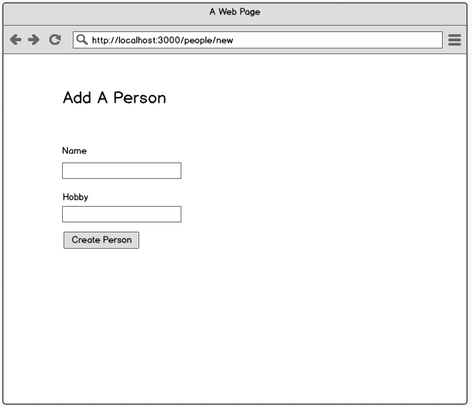
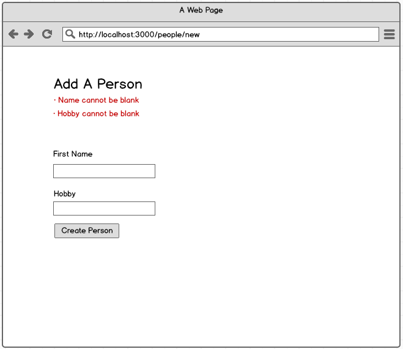

Slides: [https://slides.com/akyunaakish/express-validations]('https://slides.com/akyunaakish/express-validations')

## Fork and clone this repo to get started, make a pull request to turn it in

## Set Up

- Read through this document to get familiar with the concepts
- cd into your cloned repo in the terminal, then Generate a new express app, also install pg and knex

```
$ express --hbs --git .
$ npm install
$ npm install --save pg knex@0.9.0
```

### Database setup
* Initialize knex within the terminal inside of the root directory of this repo

```
$ knex init
```

* Replace the code inside of your knexfile.js with the code below for simplicity

```
module.exports = {

  development: {
    client: 'postgresql',
    connection: 'postgresql://localhost/knex-people',
    pool: {
      min: 2,
      max: 10
    }
  }

};
```

* In the terminal, create a database that matches the name in your knexfile(this can be done from any directory)

```
$ createdb knex-people
```

* In the root directory of this repo, create a migrations file with knex

```
$ knex migrate:make create_people
```

* Now you should have a migrations folder. In your text editor, open up the file you generated within the migrations folder and create this table schema:

```
exports.up = function(knex, Promise) {
  return knex.schema.createTable('people', function (table) {
    table.increments();
    table.string('name');
    table.string('hobby');
    table.timestamps();
  })
};

exports.down = function(knex, Promise) {

};
```

* Then run that migrations file in the root directory of this repo to add the people table to the knex-people database you created

```
$ knex migrate:latest
```

* Your knex-people database should now have a table "people" which has a name and hobby column. You can confirm this by looking in psql

```
$ psql knex-people
  select * from people;
```

* Now when you have properly created your database and table, add the line below to the 3rd line of your routes/index.js file to be able to reference your database properly in order to perform CRUD operations in your routes

```
var knex = require('knex')(require('../knexfile')['development']);
```

- When your app and database is properly setup, Complete all of the stories below

## Complete the stories below

### The homepage

```
When a user goes to the '/' route
they should be redirected to the '/people' get route
all of the people from the database should be displayed on the people.hbs page
in a table
```

### Users can create people

```
When a user goes to the site's homepage
And clicks on the anchor tag "Add a Person"
The user will be taken to a page with a create person form
When the user fills out the form
And clicks "Create Person" as long as the form was filled out properly
the person should be inserted into the database and the user should be redirected to '/people'
```


```
Then they should see the created person on the people people.hbs ('/people') page
And a success message should appear
```


### Errors are displayed when a form is not filled out correctly

```
When a user fills out a the create person form
And clicks "Create Person"
When any of the form fields are blank (or the datatype is invalid)
Then the 'new' template should be re-rendered and relevant error messages should appear
(the error messages should be added into an error array so you only see the errors that currently apply)
```


### Person names must be unique

```
When a user fills in the name field with a name that already exists
in the database
And clicks "Create Person"
Then the 'new' template should be re-rendered and an error message
should appear
that read "Name is already taken"
```

# Turn in

* Answer questions within WRITEHERE.md file before finishing

* Make a pull request with your completed code

# Stretch Goals

* Add update and delete functionality

* Properly validate the update operations so that proper data isn't replaced with invalid data and so that error messages will appear when invalid data is submitted

* When data is updated or deleted, display success messages unique to each operation
